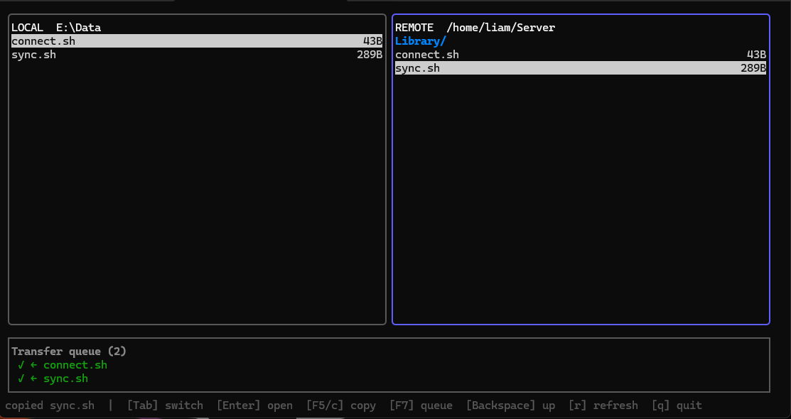

# trawl

A keyboard-driven, dual-pane terminal SFTP file manager. Connect to a host, browse local and remote
side by side, and copy files or whole directories with a keystroke.



## Install

### Linux (one-liner)

```sh
curl -fsSL https://raw.githubusercontent.com/liam-od/trawl/main/install.sh | sh
```

This installs the latest release into `/usr/local/bin` (using `sudo` if needed). To install onto
your own `PATH` without `sudo`:

```sh
curl -fsSL https://raw.githubusercontent.com/liam-od/trawl/main/install.sh | BIN_DIR="$HOME/.local/bin" sh
```

### Manual download

Grab the binary for your platform from the
[latest release](https://github.com/liam-od/trawl/releases/latest):

| Platform        | File                      |
|-----------------|---------------------------|
| Linux (amd64)   | `trawl-linux-amd64`       |
| Windows (amd64) | `trawl-windows-amd64.exe` |

On Linux, mark it executable and move it onto your `PATH`:

```sh
chmod +x trawl-linux-amd64
sudo mv trawl-linux-amd64 /usr/local/bin/trawl
```

On Windows, drop `trawl-windows-amd64.exe` somewhere on your `PATH` and run it from a terminal.

### From source

Requires Go 1.26:

```sh
go install github.com/liam-od/trawl/cmd/trawl@latest
```

or clone and build:

```sh
git clone https://github.com/liam-od/trawl
cd trawl
make build        # → bin/trawl
```

## Usage

```sh
trawl [flags] user@host[:port][:/remote/path]
trawl [flags] <saved-host-name>
```

The argument is a live target, or the name of a saved host if it contains no `@`.

```sh
trawl me@example.com                 # start in your remote home directory
trawl me@example.com:2222:/var/www   # custom port and starting path
trawl prod                           # connect to the saved host "prod"
```

On the first connection to a host you'll see its key fingerprint and be asked whether to add it to
`~/.ssh/known_hosts`. After that, a changed host key is refused automatically.

### Saved connections

`trawl --setup` opens an interactive menu, written to `~/.config/trawl/config.json`:

```
1) Edit global defaults     default user, key path, port, password fallback
2) Add a saved host         name, user@host, port, key, remote dir, local dir
3) Edit a saved host
4) Remove a saved host
5) Quit
```

Global defaults drop repetitive flags (`trawl host` instead of `trawl --user me --key … me@host`).
A saved host remembers a whole connection under a name, so `trawl prod` connects to it. Each saved
host can set a default local and remote directory so the panels open where you want; a leading `~`
expands to your local home or the remote account's home.

```sh
trawl --setup     # choose "2", name it "prod", set its dirs
trawl prod        # connects; panels open in the saved directories
```

Settings resolve as: command-line flag, then saved host, then global default, then built-in default.

### Authentication

The SSH agent is tried first, then a key file (`--key`, or `key_path` from setup), then an
interactive password prompt.

```sh
ssh-add ~/.ssh/id_ed25519      # via the agent (recommended), or…
trawl --key ~/.ssh/id_ed25519 me@host
```

### Keys

| Key | Action |
|-----|--------|
| `Tab` | switch active panel |
| `↑` / `↓` (or `k` / `j`) | move the cursor |
| `Enter` | open directory |
| `Backspace` (or `h`) | parent directory |
| `F5` / `c` | copy the selected file or directory to the other panel |
| `F7` | show / hide the transfer queue |
| `r` | refresh the active panel |
| `q` (or `F10`, `Ctrl+C`) | quit |

Copies run one at a time through the transfer queue, which shows progress and the current transfer
rate. Press `F5`/`c` again while one is running to queue more.

### Flags

```
--port N          SSH port (overrides :port in the target; default 22)
--user NAME       override the user in the target
--key PATH        private key file (otherwise the SSH agent is used)
--password        allow password authentication as a fallback (default true)
--no-password     disable the password fallback
--known-hosts P   known_hosts file (default ~/.ssh/known_hosts)
--config PATH     config file (default ~/.config/trawl/config.json)
--setup           manage saved hosts and global defaults, then exit
--version         print version and exit
--help            show this help and exit
```
